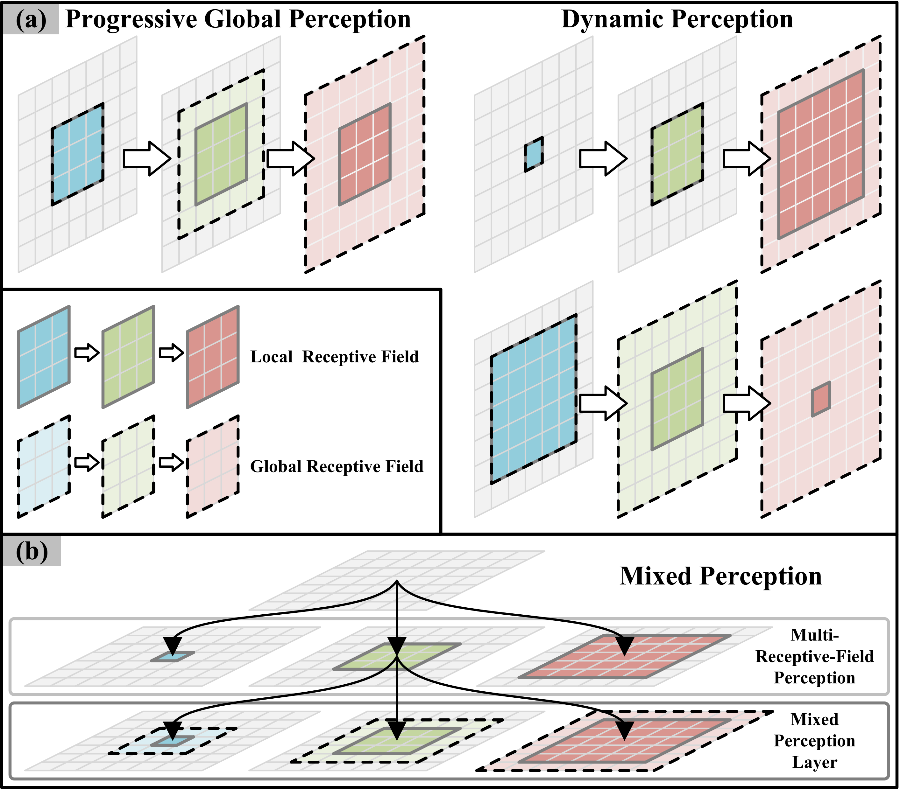
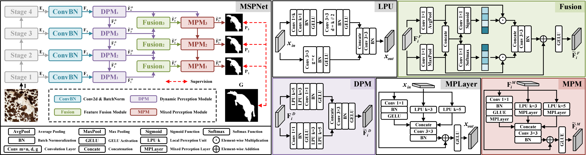
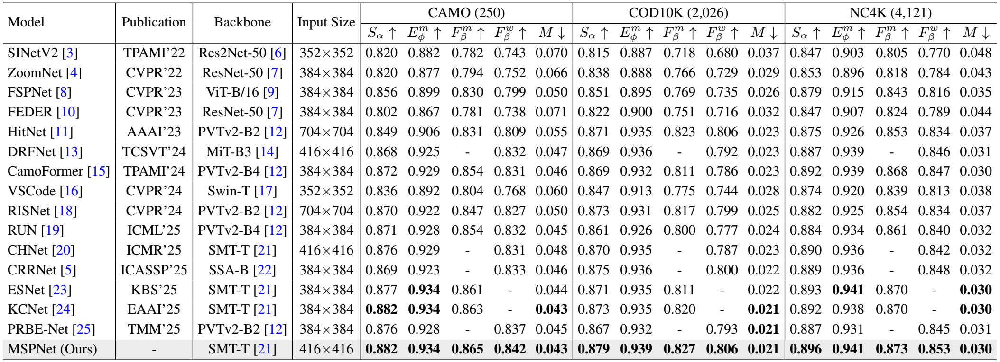

# RETHINKING MULTI-SCALE PERCEPTION FOR CAMOUFLAGED OBJECT DETECTION (ICASSP 2026)

> **Authors:** 
> Chunyuan Chen,
> Weiyun Liang,
> Mingyang Yu,
> Ji Du,
> Shujuan Li,
> and Jing Xu*.

## 1. Overview

- This repository provides code for "_**RETHINKING MULTI-SCALE PERCEPTION FOR CAMOUFLAGED OBJECT DETECTION**_", IEEE International Conference on Acoustics, Speech, and Signal Processing, 2026. [Paper]
### 1.1 Introduction

Camouflaged object detection (COD) is highly challenging due to the strong visual similarity between camouflaged objects and their surroundings in colors, textures, and shapes, as well as the variability in object scale and number. Multi-scale perception has been widely adopted to address this issue, yet existing approaches often fail to fully capture both semantic context and fine details. In this paper, we revisit multi-scale perception for COD and propose a novel Multi-Scale Perception Network (MSPNet). MSPNet is built upon two key modules: the Dynamic Perception Module, which enhances progressive global context through adaptive local perception branches, and the Mixed Perception Module, which further refines features via a nested multi-receptive-field structure to strengthen semantic awareness and spatial detail. Extensive experiments prove that MSPNet outperforms 15 state-of-the-art methods on three COD datasets.

      
    <em> 
    <b>Figure. 1:</b> <b>(a)</b> Illustrations of the progressive global perception (left) and our proposed dynamic perception (right). <b>(b)</b> Demonstration of the multi-receptive-field perception and our proposed mixed perception (equipped with the mixed perception layer). For simplicity, we only demonstrate the mixed perception layer on a single branch.
    </em>

 
### 1.2 Framework

      
    <em> 
    <b>Figure. 2:</b> Detailed structure of our proposed MSPNet, and other key components, including the local perception unit (LPU), the mixed perception layer (MPLayer), the feature fusion module (Fusion), the dynamic perception module (DPM), and the mixed perception module (MPM).
    </em>

### 1.3 Quantitative Results

      
    <em> 
    <b>Table 1:</b> Quantitative comparison with 15 SOTA methods on three COD benchmark datasets. The best results are highlighted in <b>bold</b>.
    </em>

### 1.4 Qualitative Results

      
    <em> 
    <b>Figure. 3:</b> Qualitative comparison with 9 SOTA methods under various challenging scenarios, including different sizes (large, medium, small) of objects, multiple objects, and with complex background interference.
    </em>

## 2. Proposed Baseline

### 2.0 Environment

python = 3.9

torch = 2.0.0

### 2.1. Prepare the Data

The training and testing datasets can be downloaded from https://github.com/GewelsJI/SINet-V2.

The pre-trained SMT-T weights can be downloaded from https://github.com/AFeng-x/SMT or directly from [Google Drive](https://drive.google.com/file/d/1WudsOb3Ca_eeQ_o19psXFdBuJ4udyQqf/view?usp=drive_link).

You can modify `configs.py` to set all the data paths. Here is an example of a setup:

1. Put the pre-trained SMT-T weights in the main folder like `./smt_tiny.pth`.

2. Put the training data in folder `./TrainDataset`, and put the testing data in folder `./TestDataset`.

2. `TrainDataset` should contain two folders: `Imgs` and `GT`. 

3. `TestDataset` should contain four folders: `CHAMELEON`, `CAMO`, `COD10K`, and `NC4K`. Each of the four folders contains two sub-folders: `Imgs` and `GT`.

### 2.2 Training Configuration

+ Training hyperparameters and data paths can be modified in `configs.py`.

+ Installing necessary packages:
   + pytorch: https://pytorch.org
   + pysodmetrics: https://github.com/lartpang/PySODMetrics
   + timm: https://github.com/huggingface/pytorch-image-models
   + More requirements can be found in https://github.com/akuan1234/CHNet.
  
### 2.3 Training, Inference, and Testing

+ Run `train.py` to train the model. The training log file and model checkpoints will be saved to `./result`.

+ Run `inference.py` to generate the prediction maps. Set the path to your trained model checkpoint (Line 32).

+ Run `evaluate.py` to calculate the evaluation metrics for the prediction maps. Set the path to your predictions (Line 28).

## 3. Pre-computed Maps and Trained Weights

+ Pre-computed Prediction Maps: [Google Drive](https://drive.google.com/drive/folders/1hNhpkcUasCZYLUc_nFdZ8Zn3jnaGUrJa?usp=drive_link)

+ Trained Weights: [Google Drive](https://drive.google.com/file/d/1U72wUNBR7Jmw3NhevT9Sp1W3Pcgctb4K/view?usp=drive_link)

## 4. Citation

If you find our work useful, please consider citing our paper (the citation information will be updated once the paper is online).
	
    @ARTICLE{placeholder,
        author={Chen, Chunyuan and Liang, Weiyun and Yu, Mingyang and Du, Ji and Li, Shujuan and Xu, Jing Xu},
        booktitle={ICASSP 2026 - 2026 IEEE International Conference on Acoustics, Speech and Signal Processing (ICASSP)}, 
        title={RETHINKING MULTI-SCALE PERCEPTION FOR CAMOUFLAGED OBJECT DETECTION}, 
        year={2026},
        pages={1-5},
        doi={placeholder}
    }

## Contact

If you have any questions, please feel free to contact me via email at chunyuanchen113@gmail.com or 2120240549@mail.nankai.edu.cn.

## Acknowledgement

The code is built on [CHNet](https://github.com/akuan1234/CHNet) and [SINet V2](https://github.com/GewelsJI/SINet-V2). Please also follow the corresponding licenses. Thanks for their awesome work.

    
**[⬆ back to top](#1-overview)**
